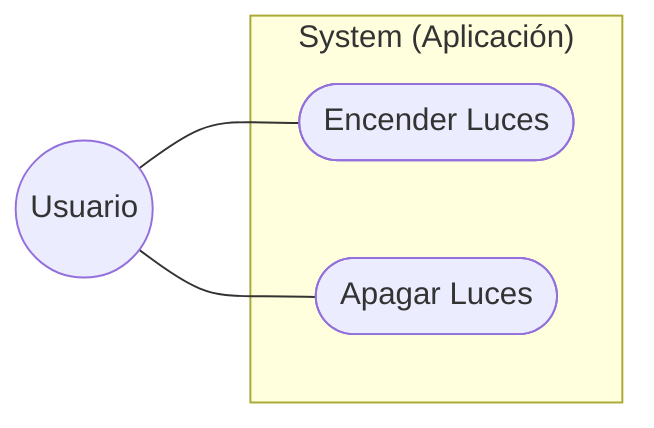

# Entornos-7.2
Repo para Diagramas de Casos de Uso

# 1. Sistema de Iluminación Inteligente

```mermaid
graph LR
%% Definir del Actor 
Usuario((Usuario))
%% Definir límite del Sistema
subgraph "System (Aplicación)"
CU1([Encender Luces])
CU2([Apagar Luces])
end
%% Definir relaciones Actor/Casos de Uso
Usuario --- CU1
Usuario --- CU2

```

# 2. Gestión de Tienda Online

```mermaid


```

# 3. Plataforma de Streaming

```mermaid


```

